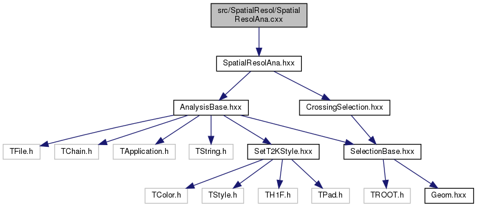

# DESY beam test analysis package

The package for the DESY beam test data analysis. There are two general method to perform your analysis:
1. so-called HighLLevel tool (recommended and supported)
2. macros (**deprecated**)

# HighLevel tool
For the DESY beam test analysis the HighLevel tool was created. The macros that we use before were good for quick checks. It's easy to create them from scratch and implement some quick analyses. During the long period of analysis we created a lot of macros and made them looking awful. The new flexible tool should allow us to create nice analysis algorithms.

The main idea is to separate the routine procedures (e.g. opening files, looping, writing the output etc.) from the analysis itself. So now the analyzer should only define the histos/canvases he want to store and the logic how to fill it.

## Tool structure
The scheme of the package for the particular case of the spatial resolution analysis and in case of using DBSCAN reconstruction.



## Compilation
For the compilation you need to create the build folder
```bash
mkdir build
cd build
```
Then you need to configure the build and run the compilation
```bash
cmake ../src
make
```

Then the code can be run with e.g.
```bash
./dEdx.exe -i input_path/input_file.root -o output_path/output_file.root
```

## The road map to start your analysis:
1. Create your analysis class inheriting from AnalysisBase. Optionally you can put it in your separate folder.
2. Add it in the CmakeList.txt for compilation. e.g.
```cmake
add_executable(SpatialResol.exe ${PROJECT_SOURCE_DIR}/SpatialResol/SpatialResolAna.cxx)
target_link_libraries(SpatialResol.exe TEvent TBase)
```
3. Define histograms you are interested in (inside `YourAnalysis::Initialize()`). Add them into `_output_vector`. They will be written into the output file automatically.
4. Choose the reconstruction you need with calling the appropriate constructor for _reconstruction (e.g. `DBSCANReconstruction()`).
5. Define the `YourAnalysis::ProcessEvent()` function. This function will be called for each event passed the reconstruction. Apply any cuts you need, fill your histograms for each event with all the information you are interested in.
6. Enjoy the output!

## Plotters
All the macroses for the result plotting are put in plotters/ folder.

### Event display
Event display for raw events is available in plotters/EventDisplay.C. With this tool the pattern of the whole event and the particular waveforms can be studied. No selection or pattern recognition is applied at this step. One can start the ROOT interactive session and then run the display with
```
.x EventDisplay.C("path-to-data-file.root")
```
Please keep in mind that for the cosmic and beam data the data structure was different so you need ta change manually the time binning: `Int_t padAmpl[36][32][510];` for Saclay cosmics and `Int_t padAmpl[36][32][511];` for the beam test data. This is the only change you need. For clearness you can limit the waveform X axis with `WFstart` and `WFend`.

## Data structure
The raw input for the analysis is 3D array (x, y, t). During the reconstruction the TEvent class object is created. It contains a vector of TTrack with a vectors of THit. In your analysis you can make a loop over tracks/hits. For the analysis simplification in the TTrack class there are vectors of rows and columns, that contain the pointers to hits in the particular row or column.

In order to speedup the analysis we implemented a feature to save the TEvent class itself. It means that the reconstruction and selection could be run once and the events that passed the selection would be saved in the TEvent format. In order to do this, run the executable with flag "-c"
```bash
./dEdx.exe -i input_path/input_file.root -o output_path/output_file.root -s
```
The output_path/input_file.root will be created that could be later used as an input. The analysis package will recognize automatically which format is used for the input file.

## Script submission
To submit script at the LXPLUS please use the script/submitter.py. It creates list of tasks and submit them to condor system. At the beginning of the file you can specify the input and output paths, versions, number of iterations (if any), job flavor and log folder. As an input you need list of input/output files: two columns separated with at least one space. Run the submitter as following:
```bash
python3 submitter.py -f ../FileLists/gain.list
```

# Geometry
The geometry information is stored in src/utils/Geom.hxx. The coordinate system and the pad size are the following:
```
Micromegas:

   31 ______________
     |              |
     |              |
 y   |              |
     |              |         Pad:
     |              |          __
   0 |______________|         |__| 1.0 cm
     0               35        1.1 cm
             x
```

The time information is stored as a 510 bins array. You have to change this variable manually for DESY beam and Saclay cosmic as the root file format was changed. So, please change src/utils/Geom.hxx with `static const int Nsamples = 510;` for Saclay data and with `static const int Nsamples = 511;` for DESY data. Otherwise you will see an error and the program will exit.

# Working with macros (**DEPRECATED**)
You could run the analysis with a simple macros (like at CERN analysis). You could find the macros template under macros/TutorialMacro.cxx

## Compilation
The compilation is possible from the macros folder. You need to specify the macro you need as a source. You are free to create subdirectories in the macro folder with your analysis. Just call the compilation from the macro folder and specify the proper path.
Make sure that the proper compiler and ROOT version are used. ROOT >= v6.16 was tested.
To setup the environment at LXPLUS you can use setup.sh without changes.
```bash
cd macros
make SRC="YourMacro.cxx"
```

The output will be stored as bin/YourMacro.exe

## Running
The macros can read both single root file and list of root files. To run the macros call
```bash
./bin/YourMacro.exe -i input_file -o output_path
```
The ROOT help could be called with -h flag. The macro help will be called with flag '-m'.
The common view is the following
```
../bin/YourMacro.exe usage

   -i <input_file>      : input file name with a path
   -o <output_path>     : output files path
   -b                   : run in batch mode
   -v <verbose_lvel>    : verbosity level
   -d                   : test mode. run over first 30 events
   -h                   : print ROOT help
   -m                   : print ../bin/YourMacro.exe help
```
