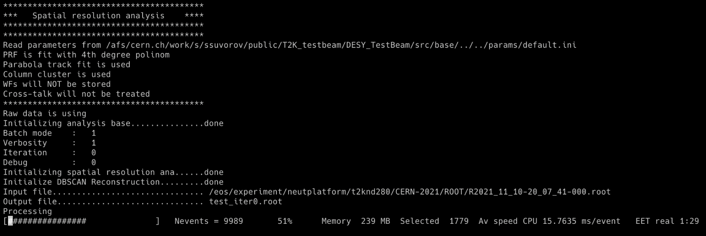
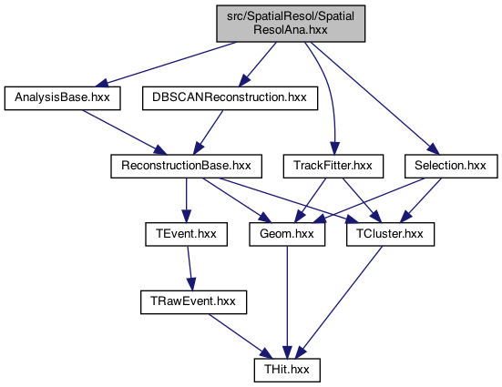

# T2K TPC beam test analysis package


The package for the T2K High Angle TPC beam test data analysis. 
Code doxygen documentation is available at [pages](https://t2k-beamtest.gitlab.io/desy_testbeam).

# HighLevel tool
For the beam test analysis the HighLevel tool was created. 
The new flexible tool should allow us to create clear analysis algorithms.

The main idea is to separate the routine procedures 
(e.g. opening files, looping, writing the output etc.) from the analysis itself. 
So now the analyzer should only define the histos/canvases/trees 
one wants to store and the logic how to fill it.

## Compilation
For the compilation you need to pull dependencies and create the build folder.
The requirements are C++14 compatible compiler and ROOT package
To work at LXPLUS the proper environment can be set up with 
`. /cvmfs/sft.cern.ch/lcg/views/LCG_100/x86_64-centos7-clang11-opt/setup.sh` 
```bash
git submodule update --init
mkdir build
cd build
```
Then you need to configure the build and run the compilation
```bash
cmake ../
make
```

Then the code can be run with e.g.
```bash
./SpatialResol.exe -i input_path/input_file.root -o output_path/output_file_iter0.root -t0 -b 
./SpatialResol.exe -i input_path/input_file.root -o output_path/output_file_iter1.root -t1 -b 
```
The detailed description of the input flags is provided in [SpatialResol/README.md](src/SpatialResol/README.md).
The expected output during the analysis is displayed below:



## Tool structure
The scheme of the package for the particular case of the spatial resolution analysis 
and in case of using DBSCAN reconstruction.



The work flow can be briefly defined with the following chain:
1. AnalysisBase open the input file and process the input. Usually it's a 3D array in x, y, t

2. Your analysis go through initialization: creating histoes and TTree you want in the output

3. AnalysisBase takes care about loop over events with AnalysisBase::Loop(). 
The range can be specified with `--start` and `--end` flags.

4. For each event the pattern recognition (reconstruction) is called
(more info [Reconstruction/README.md](src/Reconstruction/README.md)). 
The waveform treatment is done at this step. 
The reconstruction output is a `TEvent` object that contains a collection of `THit`. 
The default one is DBSCANReconstruction.

5. Successfully reconstructed track is passed to `ProcessEvent()` function of your analysis.

6. The Selection can be called inside your analysis to put a cut on angle/number of clusters, etc. 
Some selection utils are located at `Reconstruction/Selection.cxx` 
(more info [Reconstruction/README.md](src/Reconstruction/README.md)).

8. The further logic of your analysis is applied. The desired vars and histoes are filled

9. AnalysisBase::WriteOutput() takes care of storing your results in the output.

Please find the SpatialResolAna analysis logic description in a 
[dedicated readme file](src/SpatialResol/README.md). 
The main steps of the analysis are described in a logic blocks. 
The steps are commented in the source code as well.

## The road map to perform your analyses
SpatialResolAna.cxx is supposed to be the main analysis that we are working with. 
It does track position reconstruction and the charge reconstruction. 
One can check if all the necessary information is stored in the output TTree. 
If yes, the analysis can be done with a macroses over the analysis output file. 
If no, please, look through the main user cases below.

### Parameter file
The parameter file is used to define the fitters, selection, etc. 
The default one is `param/default.ini`. Any other parameter file could be used, 
with flag `--param other_file.ini` during analysis execution. 
That's how the selection ana analysis can be tuned to partiicular use case.

### Store new variables in the output
New variables can be easily implemented in the header file and then added 
in the Initialization function of any analysis. 
If you want to store an TObject (e.g. histo, tree, canvas) add one to `output_vector` 
and it will be written into the output file automatically. Example:

```cpp
_prf_histo = new TH2F("PRF_histo", "", prf_bin, prf_min, prf_max, 150, 0., 1.5);
_output_vector.push_back(_prf_histo);
```

### Cluster definition
The cluster is a part of the track that is used for the position reconstruction.
The login of the cluster creation is defined inside `TCluster.cxx`. 
At the moment four options are considered. See [arXiv:2106.12634](http://arxiv.org/abs/2106.12634)
for details:
1. Column/row clustering

2. Diagonal clustering

3. 2by1 cluster

4. 3by1 cluster

They could be switched in the parameter file.

### Track fitters
Track fitters are defined at `TrackFitter.cxx` file. 
That's how the position in the particular cluster is reconstructed. 
Afterwards clusters are fit together into track. 
One can define its own class that will do a position fitting with any algorithm one wants to test.

### Robust pads and columns to use
In the analysis one can work only with THit and TCluster that are "robust". 
E.g. clusters with larger charge can be truncated; only 2 pads in the cluster can be used and so on.
Functions `PadSelection::GetRobustPadsInColumn()` and `PadSelection::GetRobustCols()`
may contain conditions to select certain clusters and pads. 
By default, no additional conditions are applied.

## The road map to start a completely new analysis
You can start a completely new analysis that has nothing in common with the existing ones

1. Create your analysis class inheriting from AnalysisBase. 
Optionally you can put it in your separate folder.

2. Add it in the CmakeList.txt for compilation. e.g.
```cmake
add_executable(SpatialResol.exe ${PROJECT_SOURCE_DIR}/SpatialResol/SpatialResolAna.cxx)
target_link_libraries(SpatialResol.exe TEvent TBase)
```

3. Define histograms you are interested in (inside `YourAnalysis::Initialize()`). 
Add them into `_output_vector`. They will be written into the output file automatically.

4. Choose the reconstruction you need with calling the appropriate 
constructor for `_reconstruction` (e.g. `DBSCANReconstruction()`).

5. Define the `YourAnalysis::ProcessEvent()` function. 
This function will be called for each event passed the reconstruction. 
Apply any cuts you need, fill your histograms for each event with 
all the information you are interested in.

6. Enjoy the output!

## Plotters
All the macroses for the result plotting are moved 
to the separate repo [t2k-beamtest/testbeam_plotters](https://gitlab.com/t2k-beamtest/testbeam_plotters).

### Event display
The event display is available as a separate executable at repo
[t2k-beamtest/daq-reader](https://gitlab.com/t2k-beamtest/daq-reader).

Also, the event will be plotted by default in the absence of `-b` (batch) flag.

## Script submission
To submit script at the LXPLUS please use the script/submitter.py. 
It creates list of tasks and submit them to condor system. 
At the beginning of the file you can specify the input and output paths, versions, 
number of iterations (if any), job flavor and log folder. As an input you need list of 
input/output files: two columns separated with at least one space. Run the submitter as following:
```bash
python3 submitter.py -f ../FileLists/gain.list
```

By default, submiter set up the environment from LCG_100. If you use different release for the 
compilation, consider specifying your own setup script.

# Geometry
The geometry information is stored in src/utils/Geom.hxx. 
The coordinate system and the pad size are the following:
```
Micromegas:

   31 ______________
     |              |
     |              |
 y   |              |
     |              |         Pad:
     |              |          __
   0 |______________|         |__| 10.19 mm
     0               35        11.28 mm
             x
             
             
      MM numeration:
    ___  ___  ___  ___
    |0|  |1|  |2|  |3|
    ---  ---  ---  ---
    |4|  |5|  |6|  |7|
    ---  ---  ---  ---
```

The time information is stored as a 510 bins array or 511 bins array. 
The package make an automatic guess which one to use and will exit if the data format is unknown.
