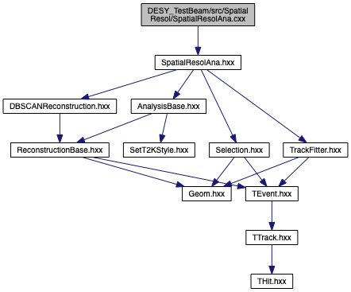

# DESY beam test analysis package


The package for the DESY beam test data analysis. Code doxygen documentation is available at [pages](https://t2k-beamtest.gitlab.io/desy_testbeam).

# HighLevel tool
For the DESY beam test analysis the HighLevel tool was created. The new flexible tool should allow us to create clear analysis algorithms.

The main idea is to separate the routine procedures (e.g. opening files, looping, writing the output etc.) from the analysis itself. So now the analyzer should only define the histos/canvases/trees one wants to store and the logic how to fill it.

## Compilation
For the compilation you need to create the build folder
```bash
mkdir build
cd build
```
Then you need to configure the build and run the compilation
```bash
cmake ../src
make
```

Before running the code please specify the `SOFTDIR` environment variable that will point to the package root folder. You can do it with:
```bash
source setup.sh
```

Then the code can be run with e.g.
```bash
./SpatialResol.exe -i input_path/input_file.root -o output_path/output_file_iter0.root -t0 -b
```

## Tool structure
The scheme of the package for the particular case of the spatial resolution analysis and in case of using DBSCAN reconstruction.



The work flow can be briefly defined with the following chain:
1. AnalysisBase open the input file and process the input. Usually it's a 3D array in x, y, t
2. Your analysis go through initialization: creating histoes and TTree you want in the output
3. AnalysisBase takes care about loop over events with AnalysisBase::Loop(). The range can be specified with `--start` and `--end` flags.
4. For each event the pattern recognition (reconstruction) is called. The waveform treatment is done at this step. The reconstruction output is a `TEvent` object that contains `TTrack` consists of `THit`. The default one is DBSCANReconstruction that returns one track per event. The maximum number of pads per track is set to 200 pads that is sufficient to select only single tracks, but may be a subject of change for other analysis.
5. Successfully reconstructed track goes to `ProcessEvent()` function of your analysis.
6. The Selection can be called inside your analysis to put a cut on angle/number of clusters, etc. Some selection utils are located at `Reconstruction/Selection.cxx`
7. The further logic of your analysis is applied. The desired vars and histoes are filled.
8. AnalysisBase::WriteOutput() takes care of storing your results in the output.

Please find the SpatialResolAna analysis logic description in a [dedicated readme file](src/SpatialResol/README.md). The main steps of the analysis are described in a logic blocks. The steps are commented in the source code as well.

## The road map to perform your analyses
SpatialResolAna.cxx is supposed to be the main analysis that we are working with. It does track position reconstruction and the charge reconstruction. One can check if all the necessary information is stored in the output TTree. If yes, the analysis can be done with a macroses. If no, please, look through the main user cases below.

### Parameter file
The parameter file is used to define the fitters, selection, etc. The default one is `param/default.ini`. Any other parameter file could be used, with flag `--param other_file.ini` during analysis execution.

### New variables to store
New variables can be easily implemented in the header file and then added in the Initialization function of any analysis. If you want to add an TObject to store (histo, tree, canvas) add it to `output_vector` and it will be stored automatically.

### Cluster definition
The cluster definition is done inside `AnalysisBase.cxx`. At the moment two main option are considered:
1. Column/row clustering
2. Diagonal clustering
3. 2by1 cluster
4. 3by1 cluster

They could be switched in the parameter file

### Track fitters
Track fitters are defined at `TrackFitter.cxx` file. That's how the position in the particular cluster is reconstructed. Afterwards clusters are fit together into track. One can define its own class that will do a position fitting with any algorithm one want to test.

### Robust pads and columns to use
In the analysis one can work only with THit and TCluster that are "robust". E.g. clusters with larger charge can be truncated; only 2 pads in the cluster can be used and so on. Functions AnalysisBase::GetRobustPadsInColumn() and AnalysisBase::GetRobustCols() may contain conditions to select certain clusters and pads. By default, no additional conditions are applied.


### Contributing to project
Please check `CONTRIBUTING.md` file with simple suggestions and advices about contribution procedure.

## The road map to start a completely new analysis
You can start a completely new analysis that has nothing in common with the existing ones

1. Create your analysis class inheriting from AnalysisBase. Optionally you can put it in your separate folder.
2. Add it in the CmakeList.txt for compilation. e.g.
```cmake
add_executable(SpatialResol.exe ${PROJECT_SOURCE_DIR}/SpatialResol/SpatialResolAna.cxx)
target_link_libraries(SpatialResol.exe TEvent TBase)
```
3. Define histograms you are interested in (inside `YourAnalysis::Initialize()`). Add them into `_output_vector`. They will be written into the output file automatically.
4. Choose the reconstruction you need with calling the appropriate constructor for _reconstruction (e.g. `DBSCANReconstruction()`).
5. Define the `YourAnalysis::ProcessEvent()` function. This function will be called for each event passed the reconstruction. Apply any cuts you need, fill your histograms for each event with all the information you are interested in.
6. Enjoy the output!

## Plotters
All the macroses for the result plotting are put in `plotters/` folder. More information about plotters can be found in `plotters/README.md`

### Event display
Event display for raw events is available in plotters/EventDisplay.C. With this tool the pattern of the whole event and the particular waveforms can be studied. No selection or pattern recognition is applied at this step. One can start the ROOT interactive session and then run the display with
```
.x EventDisplay.C("path-to-data-file.root")
```
For clearness of the plots you can limit the waveform X axis with `WFstart` and `WFend`.

## Data structure
The raw input for the analysis is 3D array (x, y, t). During the reconstruction the TEvent class object is created. It contains a vector of TTrack with a vectors of THit. In your analysis you can make a loop over tracks/hits. For the analysis simplification in the TTrack class there are vectors of rows and columns, that contain the pointers to hits in the particular row or column.

In order to speedup the analysis we implemented a feature to save the TEvent class itself. It means that the reconstruction and selection could be run once and the events that passed the selection would be saved in the TEvent format. In order to do this, run the executable with flag "-c"
```bash
./dEdx.exe -i input_path/input_file.root -o output_path/output_file.root -s
```
The output_path/input_file.root will be created that could be later used as an input. The analysis package will recognize automatically which format is used for the input file.

## Script submission
To submit script at the LXPLUS please use the script/submitter.py. It creates list of tasks and submit them to condor system. At the beginning of the file you can specify the input and output paths, versions, number of iterations (if any), job flavor and log folder. As an input you need list of input/output files: two columns separated with at least one space. Run the submitter as following:
```bash
python3 submitter.py -f ../FileLists/gain.list
```

# Geometry
The geometry information is stored in src/utils/Geom.hxx. The coordinate system and the pad size are the following:
```
Micromegas:

   31 ______________
     |              |
     |              |
 y   |              |
     |              |         Pad:
     |              |          __
   0 |______________|         |__| 1.0 cm
     0               35        1.1 cm
             x
```

The time information is stored as a 510 bins array or 511 bins array. The package make an automatic guess which one to use and will exit if the data format is unknown.


# Working with macros (**DEPRECATED**)
You could run the analysis with a simple macros (like at CERN analysis). You could find the macros template under macros/TutorialMacro.cxx

## Compilation
The compilation is possible from the macros folder. You need to specify the macro you need as a source. You are free to create subdirectories in the macro folder with your analysis. Just call the compilation from the macro folder and specify the proper path.
Make sure that the proper compiler and ROOT version are used. ROOT >= v6.16 was tested.
To setup the environment at LXPLUS you can use setup.sh without changes.
```bash
cd macros
make SRC="YourMacro.cxx"
```

The output will be stored as bin/YourMacro.exe

## Running
The macros can read both single root file and list of root files. To run the macros call
```bash
./bin/YourMacro.exe -i input_file -o output_path
```
The ROOT help could be called with -h flag. The macro help will be called with flag '-m'.
The common view is the following
```
../bin/YourMacro.exe usage

   -i <input_file>      : input file name with a path
   -o <output_path>     : output files path
   -b                   : run in batch mode
   -v <verbose_lvel>    : verbosity level
   -d                   : test mode. run over first 30 events
   -h                   : print ROOT help
   -m                   : print ../bin/YourMacro.exe help
```
